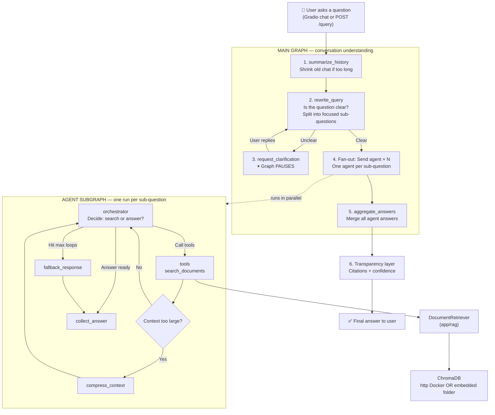
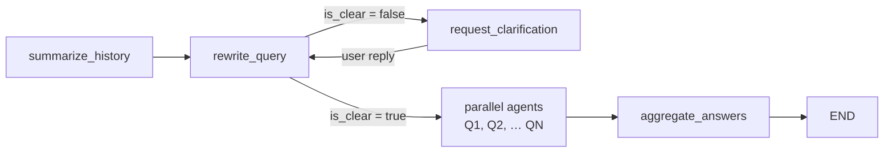
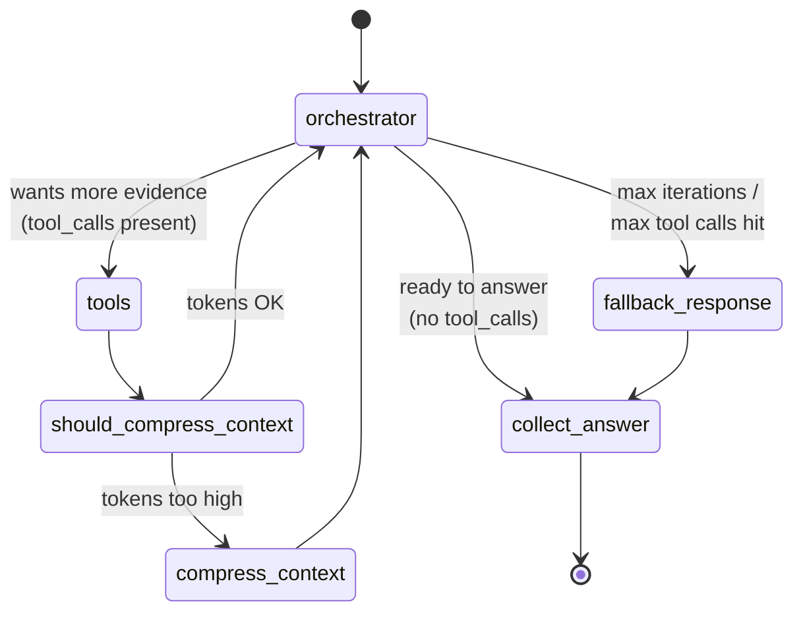

# AI-Powered Intelligent Query Resolution System

## Implemented project structure

```text
AI Powred Intelligent Query Resolution System/
├── app/
│   ├── api/
│   │   ├── auth.py
│   │   ├── upload.py              # document ingest (auth required)
│   │   └── query.py               # ask / reset conversation
│   ├── auth/
│   ├── core/
│   ├── database/
│   ├── models/
│   ├── rag/                       # Module 1 — keep as-is (Chroma + Ollama embed)
│   ├── agents/                    # Module 2 — LangGraph port (search_documents tool)
│   ├── llm/
│   ├── transparency/
│   ├── memory/
│   ├── services/
│   ├── schemas/
│   ├── ui/
│   │   └── gradio_app.py          # temporary Gradio UI (replace with React later)
│   ├── dependencies.py
│   └── main.py
├── tests/
│   ├── agent/
│   ├── rag/
│   └── test_auth.py
├── uploads/
├── docker/
├── docker-compose.yml
├── .env.example
├── pyproject.toml
└── README.md
```

## Vector store

The RAG layer talks to ChromaDB in one of two modes, selected by `CHROMA_MODE`.

| Mode | Storage | Visible in the Chroma DB VS Code extension |
| --- | --- | --- |
| `http` (default) | Standalone Chroma server | Yes |
| `embedded` | Local `chromadb/` directory | No |

```powershell
docker compose up -d
curl http://localhost:6334/api/v2/heartbeat
```

```ini
CHROMA_MODE=http
CHROMA_HOST=localhost
CHROMA_PORT=6334
```

## RAG module

Place PDF or Word files in `uploads/`. Ollama must be running with the
`mxbai-embed-large` model pulled.

```powershell
ollama pull mxbai-embed-large
uv run python -m app.rag.ingestion
```

## Multi-agent query (Module 2)

LangGraph runs a **two-level** agentic RAG pipeline. The outer (main) graph
understands the user turn; the inner (agent) subgraph retrieves evidence and
answers. Retrieval always goes through the existing `app/rag` stack via the
`search_documents` tool — not Qdrant or parent-child chunking.

### Architecture overview

Think of the system as **two nested loops**:

1. **Main graph** — understands the user, splits the ask, waits for clarification if needed, then merges answers.
2. **Agent subgraph** — for each clear sub-question, searches your documents and writes a grounded answer.

Retrieval never talks to Chroma directly from the LLM. The path is always:

```text
orchestrator  →  search_documents tool  →  DocumentRetriever  →  ChromaDB
```

---

#### Big picture (end-to-end)



---

#### Main graph in detail

What happens **once per user turn** before any document search.

| Step | Node | Plain English | Output |
| --- | --- | --- | --- |
| 1 | `summarize_history` | If the chat thread is getting long, older turns are compressed into a short summary so the LLM still fits in context. Recent messages stay as-is. | Leaner conversation history |
| 2 | `rewrite_query` | An LLM call with structured output (`QueryAnalysis`). It checks clarity, may rewrite vague wording, and can split one compound ask into several self-contained questions. | `is_clear`, `questions[]`, optional `clarification_needed` |
| 3a | `request_clarification` | Only if unclear. The graph **stops** (`interrupt_before`). UI shows the clarifying question. When the user answers, flow goes back to step 2. | Wait for user |
| 3b | `Send("agent") × N` | Only if clear. LangGraph launches **one agent subgraph per rewritten question**, often in parallel. Example: *"What is X and how does Y work?"* → 2 agents. | N agent runs |
| 4 | `aggregate_answers` | After all agents finish, one LLM pass merges their answers into a single coherent reply. | Final combined answer |



**Example — compound question**

```text
User: "What is Chetan's experience with Python, and which projects used FastAPI?"

rewrite_query →
  questions = [
    "What is Chetan's experience with Python?",
    "Which projects used FastAPI?"
  ]

→ 2 agent subgraphs run (can be parallel)
→ aggregate_answers merges both into one reply
```

**Example — unclear question**

```text
User: "Tell me about that policy"

rewrite_query → is_clear = false
             → clarification_needed = "Which policy do you mean?"

→ graph pauses at request_clarification
→ user: "The leave policy in the HR handbook"
→ rewrite_query again → now clear → agent runs
```

---

#### Agent subgraph in detail

What happens **inside each parallel agent** for one sub-question.



| Step | Node | Plain English |
| --- | --- | --- |
| A | `orchestrator` | Tool-calling LLM. Reads the sub-question + any chunks already retrieved. Chooses: call `search_documents`, answer now, or refine the search query and call again. |
| B | `tools` | Runs the tool call(s). Today the only tool is `search_documents`. |
| C | `should_compress_context` | After tools return, checks whether message history grew past the token budget. |
| D | `compress_context` | If too large, summarizes bulky tool results, then returns to the orchestrator. |
| E | loop | Back to orchestrator with new evidence. Repeats until it answers, or hits `MAX_ITERATIONS` / `MAX_TOOL_CALLS`. |
| F | `fallback_response` | Safety net when the loop cap is hit — still writes a best-effort answer from whatever was retrieved. |
| G | `collect_answer` | Saves this sub-question’s answer (+ retrieval contexts) into main graph state for aggregation. |

**Typical agent loop**

```text
orchestrator: "I need evidence"     → call search_documents("Python experience")
tools:        return top chunks      → filtered by RETRIEVAL_SCORE_THRESHOLD
should_compress_context: OK
orchestrator: "Enough evidence"     → write answer (no more tool calls)
collect_answer → done
```

**If evidence is weak**

```text
orchestrator → search_documents("Python")
tools → NO_RELEVANT_CHUNKS (or low scores dropped)
orchestrator → search_documents("Python developer experience resume")
tools → better chunks
orchestrator → answer
```

---

#### How retrieval is wired (tool → RAG → Chroma)

The agent never opens Chroma itself. The tool is a thin wrapper over your existing Module 1 RAG code.

```text
┌─────────────────┐     ┌──────────────────────┐     ┌────────────────────┐     ┌─────────────────────────┐
│  orchestrator   │────►│  search_documents     │────►│  DocumentRetriever │────►│  ChromaVectorStore      │
│  (LLM decides   │     │  (app/agents/tools)   │     │  (app/rag)          │     │  http  = Docker server  │
│   query + limit)│     │                      │     │  embed query with   │     │  embedded = chromadb/   │
└─────────────────┘     │  filters by score     │     │  mxbai-embed-large  │     │  folder on disk         │
                        │  threshold            │     └────────────────────┘     └─────────────────────────┘
                        └──────────────────────┘
```

| Layer | File | Job |
| --- | --- | --- |
| Tool | `app/agents/tools.py` | Exposes `search_documents(query, limit)` to the LLM; drops hits below `RETRIEVAL_SCORE_THRESHOLD`. |
| Retriever | `app/rag/retriever.py` | Embeds the query and runs similarity search. |
| Store | `app/rag/vector_store.py` | Talks to Chroma in `http` or `embedded` mode (`CHROMA_MODE`). |

Returned chunks look like: document id, filename, score, chunk text — formatted and joined with `CHUNK_SEPARATOR` before they go back into the orchestrator’s messages.

---

#### After the graphs finish

```text
aggregate_answers
       │
       ▼
app/transparency/
  ├── citations.py   → which files / chunks supported the answer
  └── confidence.py  → retrieval confidence score
       │
       ▼
QueryResponse / Gradio chat message
```

### How each agent / node is used

| Node | Graph | Role |
| --- | --- | --- |
| `summarize_history` | Main | Compresses older chat turns when the thread grows past the token budget, so later nodes see a short summary + recent messages. |
| `rewrite_query` | Main | Structured LLM call (`QueryAnalysis`). Decides if the question is clear, splits compound asks into self-contained sub-questions, and writes a clarification prompt when needed. |
| `request_clarification` | Main | Interrupt node. The graph **pauses** here; the UI/API shows the clarification to the user. On reply, flow returns to `rewrite_query`. |
| `agent` (subgraph) | Main | Fan-out: one parallel agent run per rewritten question (`Send`). |
| `orchestrator` | Agent | Tool-calling LLM. Decides whether to call `search_documents`, answer from evidence already in context, or keep refining the search. |
| `tools` | Agent | Executes tool calls. Today that is only `search_documents`, which wraps `DocumentRetriever.search()` and filters by `RETRIEVAL_SCORE_THRESHOLD`. |
| `should_compress_context` | Agent | Checks token growth after tools. If context is too large, routes to compression; otherwise back to the orchestrator. |
| `compress_context` | Agent | Summarizes bulky tool results so the next orchestrator turn stays inside `LLM_NUM_CTX` / token limits. |
| `fallback_response` | Agent | Used when `MAX_ITERATIONS` or `MAX_TOOL_CALLS` is hit — still produces a best-effort grounded answer instead of hanging. |
| `collect_answer` | Agent | Packages this sub-question’s final answer (+ retrieval contexts) into main state. |
| `aggregate_answers` | Main | Merges all parallel agent answers into one user-facing reply. Citations / confidence are attached by `app/transparency`. |

### Guardrails

| Setting | Purpose |
| --- | --- |
| `MAX_ITERATIONS` / `MAX_TOOL_CALLS` | Cap the orchestrator ↔ tools loop; overflow goes to `fallback_response`. |
| `GRAPH_RECURSION_LIMIT` | LangGraph hard stop for runaway graphs. |
| `RETRIEVAL_SCORE_THRESHOLD` | Drop weak Chroma hits before they enter the prompt. |
| `DEFAULT_RETRIEVAL_K` | Chunks returned per `search_documents` call. |
| `BASE_TOKEN_THRESHOLD` / `TOKEN_GROWTH_FACTOR` | When to summarize history or compress tool context. |
| `EXECUTION_LOGGING_ENABLED` | Optional stdout trace of every node / tool / route. |

### Package map

```text
app/agents/
├── graph.py              # compiles main graph + agent subgraph
├── edges.py              # route_after_rewrite, route_after_orchestrator_call
├── nodes.py              # all node functions listed above
├── tools.py              # ToolFactory → search_documents → DocumentRetriever
├── prompts.py            # system prompts per node
├── schemas.py            # QueryAnalysis structured output
├── state.py              # State (main) + AgentState (subgraph)
├── token_utils.py        # rough token estimates for compression triggers
└── execution_logger.py   # optional colored run trace
app/services/query_service.py   # owns graph lifecycle, ask / stream / reset
app/transparency/               # citations + confidence on the final answer
```

### Chat LLM providers


Switch with `LLM_PROVIDER` in `.env`. Embeddings still use local Ollama
(`mxbai-embed-large`) regardless of chat provider.

**Ollama (default)**

```ini
LLM_PROVIDER=ollama
LLM_MODEL=granite4.1:8b
OLLAMA_BASE_URL=http://localhost:11434
LLM_NUM_CTX=4096
```

```powershell
ollama pull granite4.1:8b
```

**OpenAI GPT**

```ini
LLM_PROVIDER=openai
OPENAI_API_KEY=sk-...
OPENAI_MODEL=gpt-4o-mini
# optional override:
# OPENAI_BASE_URL=https://api.openai.com/v1
```

Restart the API / Gradio after changing provider (settings are cached at startup).

## Run the API

```powershell
uv sync
uv run python -m uvicorn app.main:app --reload
```

- Auth: `/auth/*`
- Upload: `POST /upload` (JWT cookie)
- Query: `POST /query` (JWT cookie)

## Temporary Gradio UI

```powershell
uv run python -m app.ui.gradio_app
```

Opens at `http://localhost:7860` — Documents tab + Chat tab. Replace with React (Module 8) later.

## Run the tests

```powershell
uv run pytest
```
